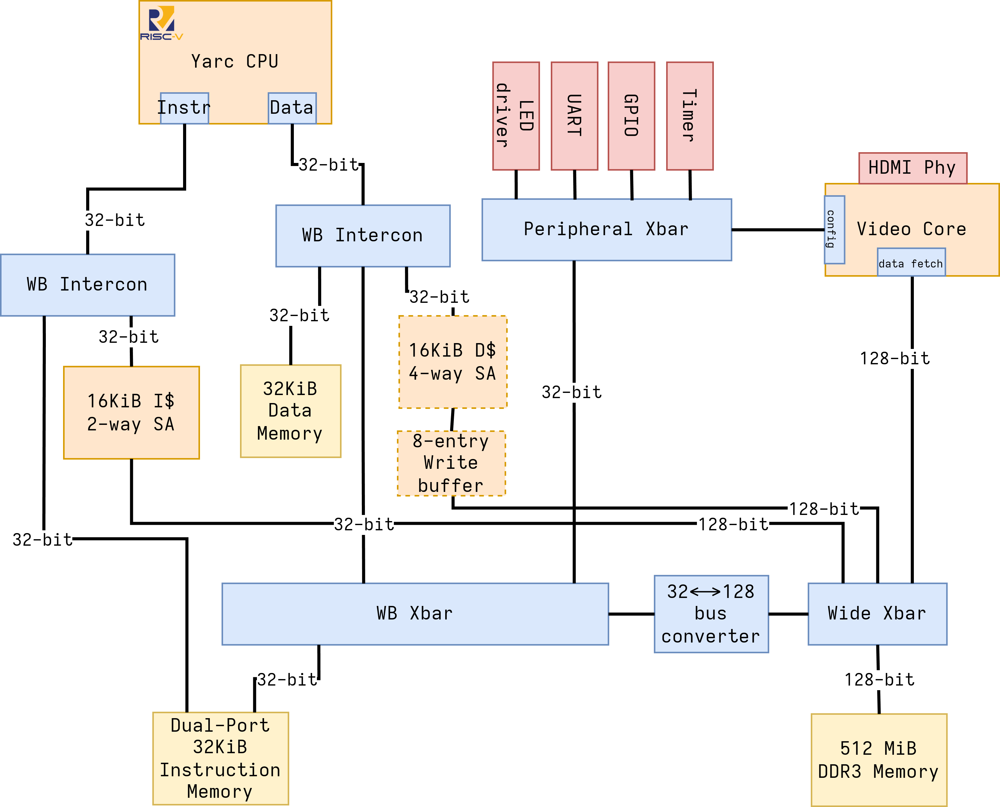

# Yarc

Yet Another RiscV Core, implements RV32I with support for additional extensions planned.

## Yarc Platform Architecture

## Core Microarchitecture

TODO

## Supported Extensions and Features

- [X] Zicsr
- [ ] M(multiplication/division)
- [ ] Debug Module

## FPGA Synthesis

TODO
